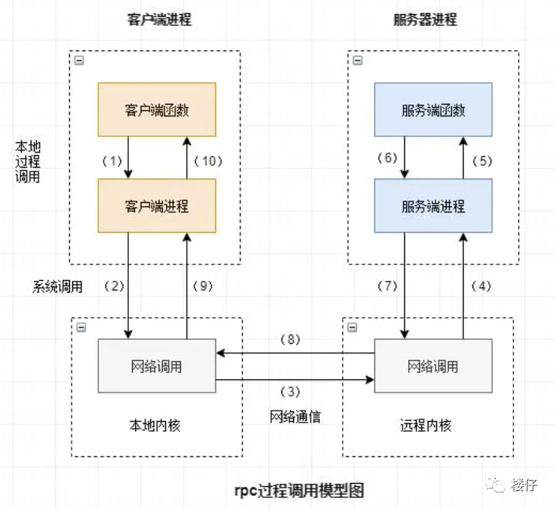

# 饼干管理的微型服务器

操作为同步而不是异步，也不需要进行连接池的操作，所以没什么开销。

目前可以实现生成，插入，删除，查询饼干，以及查看饼干的使用情况。

字段为ID (int), name(str) used(bool)，email，目前使用grpc来使用

目前支持的接口有：

AddCookie ：新增一个饼干

DeleteCookie：删除饼干

QueryCookie：name查询饼干是否存在

TestCookie：测试服务器与数据库的连接

GetCookieByID：通过ID获取name和email

GetCookieByName:通过name获取ID和email

GetCookiesByEmail：通过email获取ID和name(所有)

[gRPC](http://www.oschina.net/p/grpc-framework)  是一个高性能、开源和通用的 **RPC 框架**，面向移动和 HTTP/2 设计。目前提供 C、Java 和 Go 语言版本，分别是：grpc, grpc-java, grpc-go. 其中 C 版本支持 C, C++, Node.js, Python, Ruby, Objective-C, PHP 和 C# 支持.

gRPC 基于 HTTP/2 标准设计，带来诸如双向流、流控、头部压缩、单 TCP 连接上的多复用请求等特。这些特性使得其在移动设备上表现更好，更省电和节省空间占用。

定义的请求结构和响应结构体请查看**cookie_service.proto**

饼干提取和管理服务器为**cookie_server.py**

简单的测试饼干客户端**cookie_client.py**

使用python -m grpc_tools.protoc -I. --python_out=. --grpc_python_out=. cookie_service.proto  则可以生成

两个 Python 文件：

- `cookie_service_pb2.py`：定义了**消息类**（如 `CookieRequest` 和 `CookieResponse`）。
- `cookie_service_pb2_grpc.py`：定义了**服务类**（如 `CookieService`）。

## **RPC**

### **什么是RPC** 

​	RPC（Remote Procedure Call Protocol）远程过程调用协议。一个通俗的描述是：客户端在不知道调用细节的情况下，调用存在于远程计算机上的某个对象，就像调用本地应用程序中的对象一样。

​	比较正式的描述是：一种**通过网络从远程计算机程序上请求服务**，而不需要了解底层网络技术的协议。

那么我们至少从这样的描述中挖掘出几个要点：

- RPC是协议：既然是协议就只是一套规范，那么就需要有人遵循这套规范来进行实现。目前典型的RPC实现包括：Dubbo、Thrift、GRPC、Hetty等。
- 网络协议和网络IO模型对其透明：既然RPC的客户端认为自己是在调用本地对象。那么传输层使用的是TCP/UDP还是HTTP协议，又或者是一些其他的网络协议它就不需要关心了。
- 信息格式对其透明：我们知道在本地应用程序中，对于某个对象的调用需要传递一些参数，并且会返回一个调用结果。至于被调用的对象内部是如何使用这些参数，并计算出处理结果的，调用方是不需要关心的。那么对于远程调用来说，这些参数会以某种信息格式传递给网络上的另外一台计算机，这个信息格式是怎样构成的，调用方是不需要关心的。
- 应该有跨语言能力：为什么这样说呢？因为调用方实际上也不清楚远程服务器的应用程序是使用什么语言运行的。那么对于调用方来说，无论服务器方使用的是什么语言，本次调用都应该成功，并且返回值也应该按照调用方程序语言所能理解的形式进行描述。

### **常用的RPC框架** 

- Thrift：thrift是一个软件框架，用来进行可扩展且跨语言的服务的开发。它结合了功能强大的软件堆栈和代码生成引擎，以构建在 C++, Java, Python, PHP, Ruby, Erlang, Perl, Haskell, C#, Cocoa, JavaScript, Node.js, Smalltalk, and OCaml 这些编程语言间无缝结合的、高效的服务。
- gRPC：一开始由 google 开发，是一款语言中立、平台中立、开源的远程过程调用(RPC)系统。
- Dubbo：Dubbo是一个分布式服务框架，以及SOA治理方案。其功能主要包括：**高性能NIO通讯及多协议集成**，服务动态寻址与路由，**软负载均衡与容错**，**依赖分析与降级等**。Dubbo是阿里巴巴内部的SOA服务化治理方案的核心框架，Dubbo自2011年开源后，已被许多非阿里系公司使用。
- Spring Cloud：Spring Cloud由众多子项目组成，如Spring Cloud Config、Spring Cloud Netflix、Spring Cloud Consul 等，提供了搭建分布式系统及微服务常用的工具，如配置管理、服务发现、断路器、智能路由、微代理、控制总线、一次性token、全局锁、选主、分布式会话和集群状态等，满足了构建微服务所需的所有解决方案。Spring Cloud基于Spring Boot, 使得开发部署极其简单。

**RESTful API** 是一种基于 **REST**（Representational State Transfer）架构风格的**网络应用程序接口（API）**。它是目前最广泛使用的 API 设计方式之一，特别适用于 **Web 服务和微服务架构**。

## **RESTful API 的基本概念**：

1. **REST** 是一种**架构风格**，而不是具体的协议。它定义了一组约定和约束，使得 Web 服务能够以一种简单且标准的方式进行交互。
2. **RESTful API** 是遵循 REST 架构风格的 API，**通常使用 HTTP 协议，通过标准的 HTTP 方法（GET、POST、PUT、DELETE 等）进行通信。**

## **RESTful API 的核心特点**：

1. **客户端-服务器（Client-Server）架构**：
   - RESTful API 强调**客户端和服务器的分离**。客户端负责**用户界面和用户体验，服务器负责数据存储和业务逻辑。**
   - 客户端通过 REST API 向服务器请求资源，服务器返回响应。
2. **无状态（Stateless）**：
   - 每个请求都必须包含所有必要的信息，**服务器不会存储任何会话数据。**
   - 也就是说，每个请求都是独立的，服务器不会依赖于先前的请求信息来处理当前请求。
3. **统一接口（Uniform Interface）**：
   - RESTful API 使用统一的、标准化的接口，简化了交互方式。
   - 使用一致的资源标识符（URI）和 HTTP 方法（GET、POST、PUT、DELETE）来进行操作。
4. **资源（Resource）**：
   - 在 RESTful API 中，一切都是资源。每个资源都由一个 URI 唯一标识。
   - 资源可以是数据库中的数据、文件、图像等，它们通过 HTTP 请求进行访问和操作。
   - 资源通常是通过 **GET** 请求获取，**POST** 请求用于创建，**PUT** 请求用于更新，**DELETE** 请求用于删除。
5. **表示（Representation）**：
   - 资源的“表现形式”是可以通过 RESTful API 返回的内容。例如，数据可以以 **JSON** 或 **XML** 格式返回。
   - 服务器通过响应将资源的表现形式传递给客户端，客户端根据需要解析和展示这些数据。
6. **可缓存（Cacheable）**：
   - 服务器可以标明哪些响应是可缓存的，以提高性能。
   - 客户端可以根据缓存指令来决定是否缓存响应，以减少网络请求次数。
7. **分层系统（Layered System）**：
   - RESTful API 允许客户端和服务器之间通过代理服务器（如负载均衡器、API 网关）进行间接通信。
   - 这种层次结构帮助系统实现负载均衡、缓存等功能，而客户端通常并不知道是否通过中间层访问服务器。
8. **按需代码（Code on Demand）**（可选）：
   - 服务器可以通过响应发送可执行的代码（例如 JavaScript），客户端可以执行这些代码来扩展功能。
   - 这个特性是可选的，在许多 RESTful API 中并不使用。

### **常见的 HTTP 方法**：

在 RESTful API 中，通常使用以下 HTTP 方法来操作资源：

1. **GET**：获取资源（读取操作）。它是幂等的，即多次执行相同的 GET 请求应该返回相同的结果。
   - 示例：`GET /users/123` 获取用户 ID 为 123 的信息。
2. **POST**：创建资源。它用于提交数据，**通常在创建新记录时使用**。
   - 示例：`POST /users` 创建一个新的用户。
3. **PUT**：更新资源。它是幂等的，更新资源的整个内容。如果资源不存在，则会创建新资源。
   - 示例：`PUT /users/123` 更新用户 ID 为 123 的信息。
4. **DELETE**：删除资源。它用于删除指定的资源。
   - 示例：`DELETE /users/123` 删除用户 ID 为 123 的信息。
5. **PATCH**：部分更新资源。与 PUT 不同，PATCH 用于更新资源的一部分，而不是全部更新。
   - 示例：`PATCH /users/123` 更新用户 ID 为 123 的部分信息。
6. **OPTIONS**：获取支持的 HTTP 方法，通常用于客户端向服务器查询允许的操作。
   - 示例：`OPTIONS /users` 查看 `/users` 路径支持的 HTTP 方法。